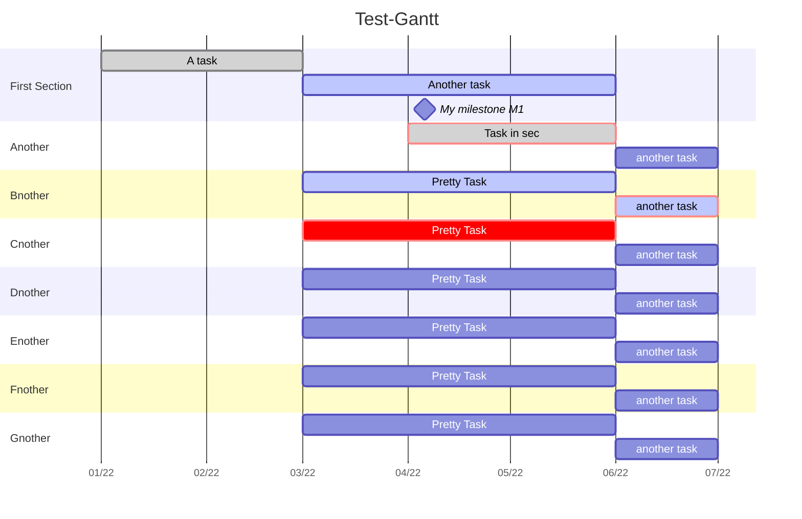

# obsidian-adjustments
A collection of code (snippets) to customize the [Obsidian note-taking app](https://obsidian.md/)

# Mermaid diagrams
Customize the look of Gantt charts generated with the built-in [Mermaid functionality](https://mermaid-js.github.io/mermaid/#/gantt) of Obsidian

### Gantt.css
This CSS snippet generates a custom look for Gantt charts that focuses on high readability in combination with the [Cybertron Theme](https://github.com/nickmilo/Cybertron)

Installation is pretty simple:

- Put `Gantt.css` into the `snippets`-directory under `.obsidian` 
- Activate **CSS snippet** under Obsidian's **Settings** -> **Appearance**

This is what the theme outputs in Obsidian:


### Example code for Gantt chart with more spacing for section labels

The default settings for the left padding (i.e. the spacing for the section labels) is `75px`. 

This example illustrates how the spacing can be enlarged by increasing the value for `leftPadding` while intiliazing the Mermaid code in Obsidian:

````

````
